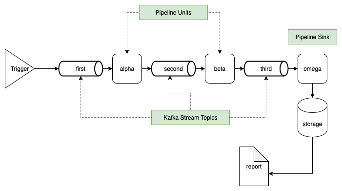

# core-streamline (Under construction)

This project implements a modular Kafka Streams data pipeline in Kotlin, designed for real-time data processing and reporting.
It demonstrates how events flow through multiple processing units, intermediate Kafka topics, and finally into persistent storage.

### Description

**Trigger** - entry point that produces initial events to Kafka  
**Kafka Topics** - intermediate topics connecting stages  
**Pipeline Units** - stream processors - microservices implemented in Kotlin using Kafka Streams API  
**Pipeline Sink** - final Kafka Consumer, which collects data from pipeline and stores the data  

### Overview

- `Trigger` is Kafka cli producer which sends single message to the pipeline on pipeline start. The message is stored in `utils/message.txt`. REST API-based trigger allowing user to send any message to the pipeline is under construction.  
- Pipeline units `alpha` and `beta` are Kafka Stream Processors. They only add their names and timestamp to original message as headers.  
- Kafka topics: `first`, `second` and `third` are regular Kafka topics. Can be configured in terraform script.  
- Pipeline sink `omega` consumes data - text messages and put them to static html file. This file is served by nginx web server to make it visible for user.  

### Project features

- Written in Kotlin using the Kafka Streams library
- Modular design with clear separation between processing units
- Intermediate Kafka topics for scalability
- Final storage and reporting sink for results
- Easy to extend with new processing units or sinks

### Technical features

- The project is organized as monorepo with shared configuration  which makes further improvements and maintenance easier. 
- Terraform makes it simple to prepare infrastructure: creates kafka topic in our case.

### Run

- Run docker containers `docker compose up -d` and wait for all containers are up
- Go to http://localhost:8090/report/index.html and check out the message.  

The message starts with:
> `[alpha::2025-10-05T18:12:52.268054195][beta::2025-10-05T18:12:52.435450385]`  
This prefixes were added by pipeline units.

